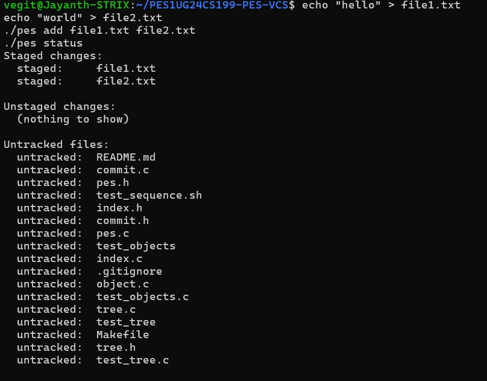
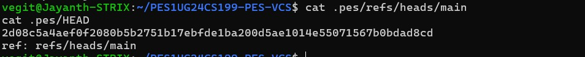
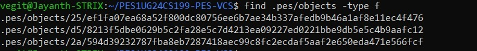
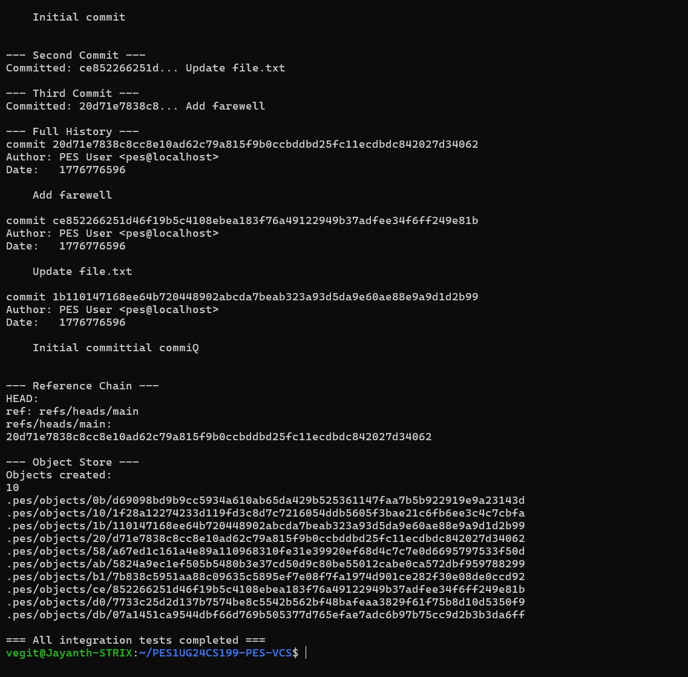
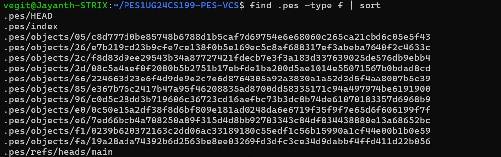

# PES-VCS (Version Control System) Project
**Name:** Jayanth Kumar P  
**SRN:** PES1UG24CS199  
**Course:** Bachelor of Technology in Computer Science, PES University (2024-2028)

## Phase 1: Object Store
*Implementation of blob storage with sharded directory structure.*
- **Screenshot 1A:** 
- **Screenshot 1B:** 

## Phase 2: Tree Objects
*Implementation of directory serialization and recursive tree construction.*
- **Screenshot 2A:** 
- **Screenshot 2B:** 

## Phase 3: The Index (Staging Area)
*Implementation of the staging area with atomic writes and change detection.*
- **Screenshot 3A:** 
- **Screenshot 3B:** 

## Phase 4: Commits and History
*Implementation of commit creation and linked history pointers.*
- **Screenshot 4A:** 
- **Screenshot 4B:** 
- **Screenshot 4C:** 

## Final Integration Test
*Full system test showing successful end-to-end VCS operations.*
- **Part 1:** 
- **Part 2:** 

---

## Phase 5 & 6: Analysis Questions

### Q5.1: Implementing `pes checkout <branch>`
To implement `checkout`, the `HEAD` file must be updated to point to the target branch reference. The working directory must then be synchronized with the snapshot stored in the branch's root tree. This involves deleting files not present in the target tree and overwriting existing files with the content of the target blobs. The operation is complex because it must handle safety checks to ensure uncommitted changes in the current working directory are not lost.

### Q5.2: Detecting a "Dirty" Working Directory
A "dirty" directory is detected by comparing the current metadata of files (mtime and size) against the metadata stored in the `.pes/index`. If the filesystem's `st_mtime` or `st_size` differs from the index entry, or if a file in the index is missing from the disk, the directory is dirty.

### Q5.3: Detached HEAD State
In a "Detached HEAD" state, `HEAD` contains a raw commit hash instead of a branch reference. Commits made here point to the previous hash as their parent, but because no branch reference tracks them, they can become orphaned if the user switches away. They can be recovered by manually creating a new branch at that specific hash.

### Q6.1: Garbage Collection Algorithm
I would use a **Mark-and-Sweep** algorithm. Starting from all branch tips and `HEAD`, the algorithm recursively traverses every commit and tree, marking their hashes as "reachable." It then scans `.pes/objects` and deletes any file whose hash was not marked. For 100,000 commits and 50 branches, you would visit at least 100,000 commit objects plus the associated tree hierarchies.

### Q6.2: GC Race Conditions
It is dangerous to run GC concurrently with a commit because a new blob might be written seconds before the commit object that references it is finalized. If GC runs in this window, it would see the blob as unreachable and delete it, resulting in a corrupted commit. Git avoids this by only pruning unreachable objects older than a specific grace period, typically 14 days.
